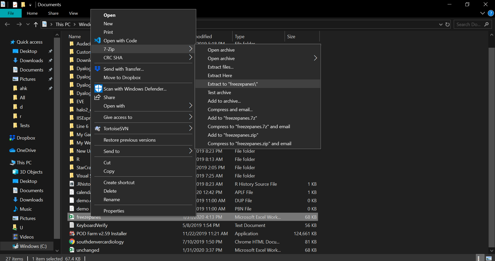
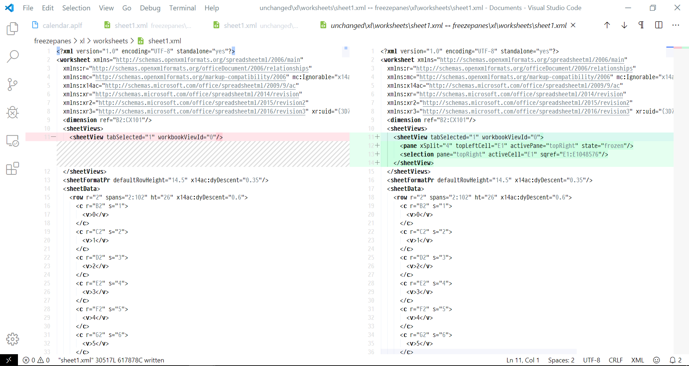
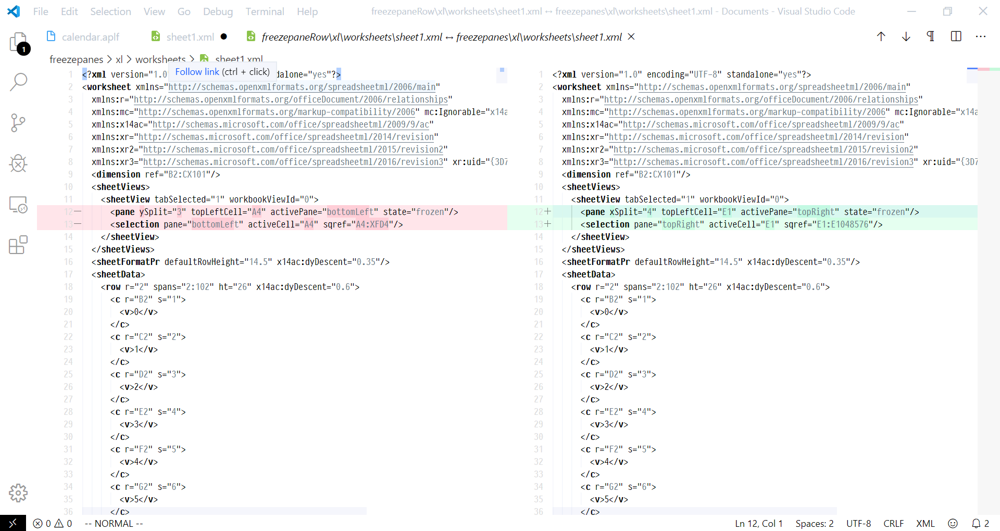

## Requirements
### Section 0.1
Excel files (files with the .xlsx extension) are zipped folders containing a strict structure of xml files and folders, with specific naming conventions. In order to follow this example, you must have zip software installed to unzip .xlsx files to view their contents. I use 7zip in the examples that follow. 

To unzip a workbook:

1. find the workbook you're interested in inspecting via the file browser
2. right click the workbook
3. If using 7zip, Hover over `7zip` in the context menu
4. Click `Extract to "{Name of workbook}/"`. This will create a named directory, into which the workbook files will be unzipped

Example:



### Section 0.2
Excel is preffered workbook viewing software. Google Docs may be used hypothetically, but no testing has been done to ensure compatibility at this time. 

### Section 0.3 
A diff tool helps immensely with identifying changes between two workbooks. In this example we will be using [Visual Studio Code](https://code.visualstudio.com/) with an additional extension installed to aid with the diffing, and automatic formating of xml. `XML Tools` is a Visual Studio Code extension which can automatically format XML documents for viewing. There are [XML Beautifiers](https://xmlbeautifier.com/) available online, but you may find it much easier to have the feature available alongside the editor and diffing tools we will be using. 

### Section 0.3.1
To Install XML Tools in VSCode:

1. With Visual Studio Code open (assuming default hotkeys), press `Ctrl+P`
2. Inside the text bar that appears, type `> Ext install` including the '>' and press return
3. A new side bar will appear on the left side of VSCode
4. In the search bar type `XML Tools`. Search for the extension published by Josh Johnson
5. Click the small blue button labeled `Install`. Once installed it may be necessary to reload your VSCode window. 
6. press `Ctrl+P`
7. Type `> Reload Window`

### Section 0.3.2
In order to use the XML Tools for formatting

1. Inside VSCode, open an XML document
2. press `Ctrl+P`
3. Type `> XML Tools: Format as XML`

If the document is not already formatted, the XML will be normalized. 

### Section 0.4
It is expected that you have a minimum level of understanding of OOXML and Excel workbook structure. If you need an introduction, [this article](http://officeopenxml.com/anatomyofOOXML-xlsx.php) should suffice for following along with this document. Use the three links on the left-hand side of the page to expand on different subjects. 


## How to add a new feature - Identifying New XML
This documents how to add a new feature. In this example we will be implementing FreezePanes. Before implementing a feature, it is necessary to understand the basic structure of .xlsx files. First, generate a test `.xlsx` document from which to work. In this example, we will use the template function from the testing library. 

### Section 1.1
```apl
    Test.Utility.BasicWS 100 100
```

This function takes 1 or 2 arguments. One argument generates a shape `⍵ 4` output in Excel, 2 arguments generates a shape `⍵[0] ⍵[1]` ouput in Excel. The result of this function is the name of the output file. Use `]open` to open the file in Excel.

### Section 1.2 
```apl
    ]open C:/Users/natha/AppData/Local/Temp/XL2APLSimpleSheet.xlsx
```

Create a copy of this file by saving the file to a directory of your choice. I will be saving a copy of this file to `c:\Users\{user}\Documents\unchanged.xlsx`. 

### Section 1.3
1. At the top left of the Excel screen, click 'File'
2. Click 'Save As'
3. Under 'Other Locations', click 'Browse'
4. Navigate to the desired directory and rename the file 

Next we need to make a change to the document. [This article](https://support.office.com/en-us/article/freeze-panes-to-lock-rows-and-columns-dab2ffc9-020d-4026-8121-67dd25f2508f) contains a video demonstrating how to enable freeze panes within a document. We will first test column-wise freeze panes. 

### Section 1.4
1. Select the 'E' column by clicking 'E' at the top of the column 
2. At the top of the navigation bar, click 'View'
3. Click 'Freeze Panes'
4. In the dropdown menu, click 'Freeze Panes'
5. Verify that the columns A-D are static, while from E onwards to the right scroll left and right

Now that we have made modifications, repeat the steps in 1.3 to save the file as. Only this time, instead of naming the file `unchanged.xlsx`, rename the file `freezepanes.xlsx`. Next, [unzip](#Section-0.1) both workbooks using the method described in Section 0.1. 

### Section 1.5
Open a command prompt, and change the working directory to your selected directory and use the diff tool to identify what files are different between the two workbooks, then run the following diff command.

```
C:\Users\nathan>cd Documents
C:\Users\nathan\Documents>diff ./freezepanes ./unchanged
Common subdirectories: ./freezepanes/_rels and ./unchanged/_rels
Common subdirectories: ./freezepanes/docProps and ./unchanged/docProps
Common subdirectories: ./freezepanes/xl and ./unchanged/xl

C:\Users\nathan\Documents>
```

This program identified 3 files that are different between the two workbooks. `./unchanged/_rels`, `./unchanged/docProps`, `./unchanged/xl` are either folders, or files that we will now diff inside VSCode. If you don't have it installed, or don't have the extensions used below, please see [Section 0.3](#Section-0.3) First, normalize the files that we will be looking at. 


### Section 1.6
1. Open a file explorer 
    - Navigate to the containing folder
    - Right click within the window
    - Select `Open with Code`
2. With the directory open in VSCode, expand `./unchanged/xl/worksheetes` and open `sheet1.xml`
    - Use the XML Tools [section 0.3](#Section-0.3)
    - Save the file
3. Repeat step 2 for `./freezepanes/xl/worksheets/sheet1.xml`
4. Right click `./freezepanes/xl/worksheetes/sheet1.xml`
    - Click `Select for Compare`
    - Right click `./unchanged/xl/worksheets/sheet1.xml`
    - Click `Compare with Selected`

You will now see the lines that are different between the two files. This is the first step to adding any new feature, identifying the XML that needs to be generated, and which part of the file the generated XML needs to be inserted. The XML for column-wise freeze panes has now been identified. Repeat the process for row oriented freeze panes. 


### Section 1.7

Reopen our Freezepane workbook, and modify the freezepane settings so that rows are frozen in place, rather than columns.

1. Following our convention open your freeze pane workbook at `c:\Users\{username}\freezepanes.xlsx`
2. In the navigation bar click `View`
3. Click `Freeze Panes`
4. Click `Unfreeze Panes`
5. On the lefthand side of the worksheet, click `4` on the row id column
6. Click `Freeze Panes`
7. Click `Freeze Panes`
8. Repeat the process in [Section 1.3](#Section-1.3) for saving a new file. Name this file `freezepaneRow.xlsx`
9. Repeat the process in [Section 1.5](#Section-1.5) for decompressing and comparing 2 files, except now we will compare `freezepaneRow` and `freezepanes`
10. Repeat the process in [Section 1.6](#Section-1.6) for comparing 2 files in VSCode

```Cmd
C:\Users\nathan\Documents>diff freezepaneRow freezepanes
Common subdirectories: freezepaneRow/_rels and freezepanes/_rels
Common subdirectories: freezepaneRow/docProps and freezepanes/docProps
Common subdirectories: freezepaneRow/xl and freezepanes/xl

C:\Users\natha\Documents>
```




## How to add a feature - Generating new XML

In the previous sections we have identified the differeing XML betwen a default worksheet and between two different worksheets containing freeze panes. The first sheet contained only this one line within the `sheetViews` tag. 
```XML
  <sheetViews>
    <sheetView tabSelected="1" workbookViewId="0"/>
  </sheetViews>
```

The worksheets that contained the freezepane settings nested the pane configuration inside of the sheetView tag, within sheetViews. Below is a template, as a demonstration of which pieces of this XML are parameterized depending on the freezepane settings. All but one of the `{?}` parameters is an XML parameter, but one is an XML property as well. We must programatically determine the values which must be placed to make this XML valid. 
```XML
  <sheetViews>
    <sheetView tabSelected="1" workbookViewId="0">
      <pane {?}="{?}" topLeftCell="{?}" activePane="{?}" state="frozen"/>
      <selection pane="{?}" activeCell="{?}" sqref="{?}:{?}"/>
    </sheetView>
  </sheetViews>
```

### Section 2.1

The `<pane>` tag contains a changeable property `xSplit` and `ySplit` depending on the orientation of the freeze pane. The workbook `freezepaneRow` contains `ysplit`, thus when freezing rows, the `<pane>` tag uses the `ySplit` property. The `<pane>` tags' `activePane` property, as well as the `<selection>` tags' `pane` property are both derived from orientation. The `topLeftCell` and `activeCell` appear to be the same values, and are calculated based on how many rows or columns are to be frozen.

The previous template could be simplified as follows:
```XML
  <sheetViews>
    <sheetView tabSelected="1" workbookViewId="0">
      <pane {orientation}="{?}" topLeftCell="{count}" activePane="{orientation}" state="frozen"/>
      <selection pane="{orientation}" activeCell="{count}" sqref="{count}:{orientation}"/>
    </sheetView>
  </sheetViews>
```

### Section 2.2

The following code is aligned columnwise to provide visualization of calculating or selecting the correct values based on orientation. `itc` is a utility function within the `Main.XL` namespace that converts APL index values to Excel addresses. `itc` stands for `index to cell` conversion. If you have `APL2XL` linked within your workspace, you should be able to past these examples into your session and verify the output. 
```APL
(count orientation)←4 'columns'
scount←⍕count
itc  ←Main.XL.itc

o    ←      'rows'          'columns' ⍳ ⊂orientation
pane ←    o⊃'bottomLeft'    'topRight'
split←    o⊃'ySplit'        'xSplit'
addr ←itc o⊃(count,0)       (0,count)
range←    o⊃(('XFD',¯1↑addr) ((⊃addr),'1048574'))
```

We'll use the preceding variables to form a valid argument for ⎕XML
```APL
paneAttrs   ←4 2⍴ split  scount 'topLeftCell' addr 'activePane' pane 'state' 'frozen'
selectAttrs ←3 2⍴ 'pane' pane   'activeCell'  addr 'sqref'(addr,':',range)
freezePane←(2 'pane' ''paneAttrs)(2 'selection' ''selectAttrs)

sheetViewAttrs←↑(('tabSelected' 1) (wbv←'workbookViewId' '0'))
⎕XML↑(0 'sheetViews' ''(0 2⍴''))(1 'sheetView' ''sheetViewAttrs),freezePane
```         

And the result? Precisely the XML we had in our original workbook. To get the same result as our `freezepaneRow` change `count` to `3`, and `orientation` to `'rows'`. 
```XML
<sheetViews>                                                                      
  <sheetView tabSelected="1" workbookViewId="0">                                  
    <pane xSplit="4" topLeftCell="E1" activePane="topRight" state="frozen"></pane>
    <selection pane="topRight" activeCell="E1" sqref="E1:E1048574"></selection>   
  </sheetView>                                                                    
</sheetViews>          
```

### Section 2.2

The sheetViews tag is unique per worksheet, and therefore this XML generation must be performed on a per worksheet basis. Since a workbook can contain multiple worksheets we must take proper care that the XML generated is also placed within the correct worksheet xml file. The questions we must answer are these: 

1. Where do should the XML be generated?
2. When should the function be called?
3. Where is the XML, or XML-data stored?
4. Where do should the generated XML be placed so that it appears in the correct place in the correct file?

#### Where do should the XML be generated?
In brief, the `Main/XL` directory contains all code for managing XML data, and generating XML from data. `Main/XL/WSViews` is a function created for the purpose of generating code contained within the `<sheetViews>` tag, which is unique per sheet. ***Important Note:*** Since the freeze pane feature is currently the only feature that uses the `sheetViews` part of a worksheet, no consideration of existing functionality was necessary at this time. In the future, it is possible that other features will require modification, extension, or a rewriting of existing features if there is overlap in the XML generation. As this was a new feature, creating a clean new function named after the XML tag it generates was simple. 

#### When should the function be called?
```APL
sheet←⎕NS''
sheet.Name←'Employees'
sheet.Rangesrange1 range2
sheet.FreezePane←1 'rows' ⍝ or 'columns'

wb←⎕NS''
wb.Sheets←sheet
wb.FileName←(739⌶0),'/Employees.xlsx'
Main.Export wb
```
`Main.Export` contains a main loop, and a nested loop. The outer loop is performed `¨WB.Sheets`, while the inner loop is performed `¨∊WB.Sheets.Ranges`. Since the inner loop compiles data relevant to ranges in a given Sheet, it doesn't handle individual sheet meta data. While styles apply to cells which are part of ranges, the freeze panes have no bearing on the ranges, and are conceptually settings for the sheet, rather than anything to do with cellular configuration. That said, the sheet meta data is never passed to functions within the inner loop, and thus is only contained in the outer loop. This is where we will call `Main.XL.WSViews`, because we have the configuration settings available for any given worksheet. 

```APL
_←wb ##.Main.XL.WSViews sheet ⍝ handle global worksheet properties
```

Per the sheet and wb definitions provided in the preceding paragraph, `sheet.FreezePane` is all the data that the WSViews function needs to set the configuration for freezepanes for this worksheet, so pass the current sheet to WSViews, generating the XML.


#### Where is the XML, or XML-data stored?
The backbone datastructure of `APL2XL` is the `wb` namespace returned from the `Main/XL/WB` function. This namespace contains all the data which will be required upon exporting the various Excel parts. When a new data structure is needed for enabling a new feature, a new data structure is added to the `WB` function. In this case, we created the `wb.SheetViews` property inside of `WB` to keep track of the data required for the sheetViews tag. 

With our new data structure in place, we can now populate `wb.SheetViews` with some data. Our new feature in the case of freezepanes is very simple, and thus we created the XML directly using ⎕XML, and so `wb.SheetViews` consists of 2 columns, the XML and the name of the worksheet the XML is associated with. 


#### Where do should the generated XML be placed so that it appears in the correct place in the correct file?
`Main.XL.WSXML` is responsible for generating XML for WS. The naming convention for filenames is {PartAbbreviation}{Purpose}, in this case, WS is the OOXML "Part" abbreviation for Worksheet, and XML is stating that it's purpose is XML generation. `WSViews` for instance is the Worksheet Views tag, but `WSXML` is the Worksheet XML generation function. Files named with the XML identifier I called just before exporting the files, in order to generate any remaining XML, compile all that is required, and write the XML to file. 

To ensure that the feature is included with the workbook when the files are exported, look for the `Main/XL/{part}XML.aplf` file, and append the new XML data where it is appropriate. In our case, we want to modify worksheet file output, and so we are looking for `Main/XL/WSXML.aplf`. Within `WSXML` there is a `sheet` function which generates XML file contents for each sheet. The sheet function is porvided the `sheetName`, and so we simply look up the `<sheetViews>`  for the sheet by `sheetName` and include it as part of the output of the `sheet` function, as seen below. The following code selects the correct `wb.SheetViews` by `sheetName`, and we include the result in the return expression of the `sheet` function. 

```APL
⍝⍝⍝: Excerpt from Main.XL.WSXML.aplf
sheetViews←⊃wb.SheetViews[wb.SheetViews[;0]⍳1↑sheetName;1]

⍝. Complete <sheetdata> body
∊worksheet wattrs tag dimension sheetViews sheetdata  
```


